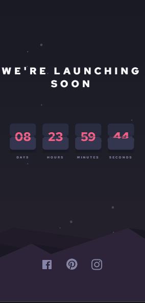

### <div align="center">Choose your language | Escolha seu idioma </div>

<div align="center">

[](https://github.com/edilan-ribeiro/fm-launch-countdown-timer/blob/main/README.en.md)
[](https://github.com/edilan-ribeiro/fm-launch-countdown-timer/blob/main/README.md) <br>


</div>
<br>
<a name="readme-top"></a>


<br />
<div align="center">
 <a href="https://github.com/edilan-ribeiro/fm-launch-countdown-timer">
    
  </a>

<h3 align="center">Launch Countdown Timer</h3>

  <p align="center">    
    Challenge by FrontEnd Mentor about a page with a countdown timer
  </p>
  
  <a href="https://fm-launch-countdown-timer-beta.vercel.app/">View Demo</a>
</div>

<br>

<details>
  <summary>Table of Contents</summary>
  <ol>
    <li>
      <a href="#about-the-project">About The Project</a>
      <ul>
        <li><a href="#built-with">Built With</a></li>
        <li><a href="#highlights">highlights</a></li>
        <li><a href="#challenges-and-lessons-learned">Challenges and lessons learned</a></li>
      </ul>
    </li>
    <li><a href="#usage">Usage</a></li>
    <li><a href="#contact">Contact</a></li>
  </ol>
</details>

<br><br>

## About The Project

 

<br>This project is a countdown timer to a website launch!




<p align="right">(<a href="#readme-top">back to top</a>)</p>


### Built With

<div align="center">


</div>


<p align="right">(<a href="#readme-top">back to top</a>)</p>


## Highlights

Despite animation being a bonus for the challenge, unfortunately, I tried in various ways and couldn't achieve a smooth transition in this flip animation. As I chose not to copy or use a library (most of which lack the necessary customization), and there aren't many more modern examples, this was the result. 😖

<p align="right">(<a href="#readme-top">back to top</a>)</p>

## Challenges and lessons learned

🌬️ Tailwind CSS<br/>
I conducted a learning test to see if I could handle this framework used in some of the world's largest tech companies. The result was surprising and pleased me greatly.

The unfortunate parts were witnessing code repetition in multiple lines and over 50 lines of CSS within a single component.😨

⏲️Timer!<br/>
The most crucial part of the project was ensuring that the timer functioned correctly. To achieve this, it was necessary to calculate the total time from one date to another and then divide this time according to the desired card (days, hours, minutes, seconds). Additionally, handling was implemented in case the time runs out, and a message will be displayed.

🥶 Flip animation <br/>
I believe the real challenge is this: the final boss has a lot of HP, and several attempts are necessary to complete it.

I tried so many things, from animations using cubic-bezier, longer/shorter transitions, step transitions, changes in cards, interval alterations, and, in the end, the closest I could get is here. 😬

I believe the mistake might be in the application of setTimeout related to the flip cards. However, I couldn't resolve it 😥


In summary, it was possible to learn and practice:
- Learn a bit of Tailwind CSS and its possibilities.
- JavaScript counting logic.
- Practice React extensively.

<p align="right">(<a href="#readme-top">back to top</a>)</p>

## Usage

After cloning, downloading, or forking, use the command below to install the project dependencies:
```shell
npm install
```

This project allows you to:
- Watch the countdown
- Changing "currentDayTime" in the "timeCalculation" function can accelerate the countdown to reach the end.

<p align="right">(<a href="#readme-top">back to top</a>)</p>

## Contact

💌 To send me a message, just use one of the buttons below!<br>

  <a href = "mailto:edilanbusiness@gmail.com" target="_blank"></a>
  <a href="https://www.linkedin.com/in/edilan-ribeiro-santos" target="_blank"></a> 
  <a href="https://whatsa.me/5561983769634/?t=Hello,%20I%20came%20from%20your%20GitHub!" target="_blank">
  </a>


<p align="right">(<a href="#readme-top">back to top</a>)</p>
