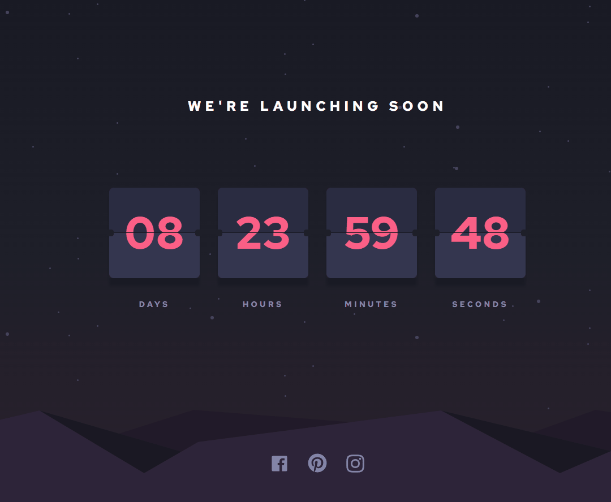
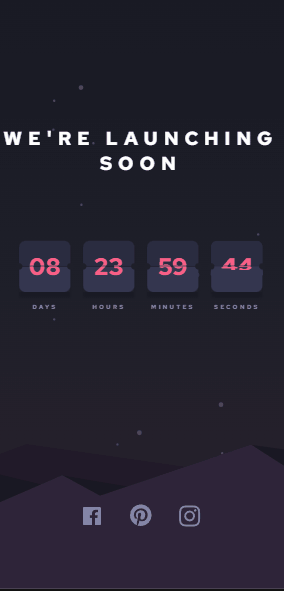

### <div align="center">Escolha seu idioma | Choose your language </div>

<div align="center">

[](https://github.com/edilan-ribeiro/fm-launch-countdown-timer/blob/main/README.md) 
[](https://github.com/edilan-ribeiro/fm-launch-countdown-timer/blob/main/README.en.md)<br>


</div>
<br>
<a name="readme-top"></a>

<br />
<div align="center">
  <a href="https://github.com/edilan-ribeiro/fm-launch-countdown-timer">
    
  </a>

<h3 align="center">Launch Countdown Timer</h3>

  <p align="center">
    Desafio do FrontEnd Mentor de uma página com um contador regressivo
  </p>
  
  <a href="https://fm-launch-countdown-timer-beta.vercel.app/">Ver online</a>
</div>

<br>

<details>
  <summary>Índice</summary>
  <ol>
    <li>
      <a href="#sobre-o-projeto">Sobre o projeto</a>
      <ul>
        <li><a href="#feito-com">Feito com</a></li>
        <li><a href="#notas-de-destaque">Notas de destaque</a></li>
        <li><a href="#desafios-e-aprendizados">Desafios e aprendizados</a></li>
        </ul>
    </li>
    <li><a href="#utilização">Utilização</a></li>
    <li><a href="#contato">Contato</a></li>
  </ol>
</details>

<br><br>
## Sobre o projeto

 


<br>Esse projeto é um contador de tempo para o lançamento de um site!




<p align="right">(<a href="#readme-top">back to top</a>)</p>


### Feito com

<div align="center">


</div>

<p align="right">(<a href="#readme-top">back to top</a>)</p>


## Notas de destaque

Apesar da animação ser um bônus para o desafio, eu infelizmente tentei de várias formas e não consegui fazer uma boa transição nessa animação de flip, e como optei por não copiar, não usar uma lib (a maioria não tem a customização necessária), nem há tanto exemplos  mais modernos e esse foi o resultado. 😖


<p align="right">(<a href="#readme-top">back to top</a>)</p>

## Desafios e aprendizados

🌬️ Tailwind CSS<br/>
Fiz um teste de aprendizado para ver se conseguiria lidar com esse framework que é utilizado em algumas das maiores empresas de tech do mundo, o resultado foi surpreendente e me agradou bastante.

As partes tristes foram ver repetição de código em mais de uma linha e mais de 50 linhas de CSS dentro de um único componente. 😨

⏲️Timer!<br/>
A parte mais importante do projeto era garantir que o timer funcionasse adequadamente, para isso foi necessário pegar o tempo total de uma data até outra e dividir esse tempo de acordo com o card desejado (dias, horas, minutos, segundos). Além disso também foi feito o tratamento aondecaso o tempo acabe será exibida uma mensagem.

🥶 Animação de flip <br/>
Acredito que o real desafio seja esse, é o boss final tem muito hp e várias tentativas são necessárias pra concluir.

Tentei usar tanta coisa, desde animações usando cubic-bezier, transições maiores/menores, transições com etapas, mudanças nos cards, alteração de intervalos e no final o mais próximo que eu consegui chegar foi aqui. 😬

Eu acredito que o erro esteja na aplicação do setTimeOut relacionado aos cards de flip, todavia não consegui solucionar 😥


Em resumo foi possível aprender e praticar:
 - Aprender um pouco de Tailwind CSS e suas possibilidades
 - Lógica de contagem do JavaScript
 - Praticar bastante React

 <p align="right">(<a href="#readme-top">back to top</a>)</p>

## Utilização

Após clonar, baixar ou fazer um fork, utilize o comando abaixo para instalar as dependências do projeto:

```shell
npm install
```

Esse projeto te permite:
- Ver uma contagem regressiva
- Alterar "currentDayTime" na função "timeCalculation" pode acelerar o tempo do contador pra chegar no fim

<p align="right">(<a href="#readme-top">back to top</a>)</p>

## Contato

💌 Para me mandar uma mensagem basta usar um dos botões abaixo!<br>

  <a href = "mailto:edilanbusiness@gmail.com" target="_blank"></a>
  <a href="https://www.linkedin.com/in/edilan-ribeiro-santos" target="_blank"></a> 
  <a href="https://whatsa.me/5561983769634/?t=Ol%C3%A1,%20vim%20atrav%C3%A9s%20do%20seu%20GitHub!" target="_blank">
  </a>


<p align="right">(<a href="#readme-top">back to top</a>)</p>
